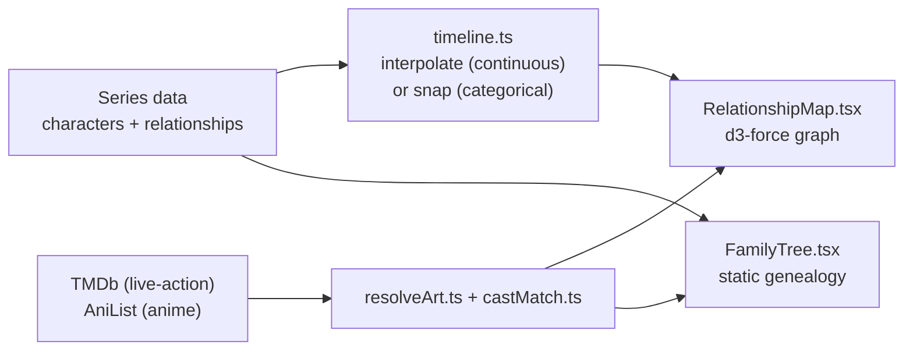

<!-- =============================================================== -->
<!--                                                                 -->
<!--   Entangled · A season scrubber for any TV series' relationships -->
<!--                                                                 -->
<!-- =============================================================== -->

<div align="center">

<br />

<h1>
  <span style="letter-spacing: 0.08em;">E</span>·<span style="letter-spacing: 0.08em;">N</span>·<span style="letter-spacing: 0.08em;">T</span>·<span style="letter-spacing: 0.08em;">A</span>·<span style="letter-spacing: 0.08em;">N</span>·<span style="letter-spacing: 0.08em;">G</span>·<span style="letter-spacing: 0.08em;">L</span>·<span style="letter-spacing: 0.08em;">E</span>·<span style="letter-spacing: 0.08em;">D</span>
  <br />
  <sub><sup>a season scrubber for any cast</sup></sub>
</h1>

<p>
  <em>Watch a show's relationships breathe, season by season.</em>
</p>

<p>
  Drag one slider and a whole-cast force graph morphs smoothly instead of<br />
  jumping between states — trust, affection, power and tension, all evolving live.
</p>

<br />

<p>
  <a href="#-quick-start"></a>
  <a href="#-data-model"></a>
  <a href="#-adding-a-series"></a>
</p>

<p>
  
  
  
  
</p>

</div>

<br />

<p align="center">
  <em>Game of Thrones · 23 characters · 46 relationships · 8 seasons</em>
  <br />
  <em>The Apothecary Diaries · 19 characters · 34 relationships · 2 seasons</em>
  <br />
  <em>Charmed · 12 characters · 14 relationships · 8 seasons</em>
</p>

---

## ✦ Why this exists

Most "character relationship" pages are wikis with arrows — flat, static, and true for exactly one moment in the story.

**A relationship isn't flat.** A master-and-servant arrangement becomes a romance. A frosty rival becomes an ally. A "brother" turns out to be a secret son. Entangled treats a season of television as a **timeline**, not a snapshot:

- Every character has a per-season **prominence** (how much that season is "about" them) and, when they're not in the story yet, a `firstSeason` they're introduced in.
- Every relationship carries per-season **trust / affection / power / tension** scores, and — when the bond itself changes category, not just intensity — a per-season sequence of **types** too.
- One continuous scrubber drives all of it. Nodes grow and shrink, edges recolor, lines dash in and out, and the whole cast's force layout reheats smoothly instead of snapping between five fixed poses.

Directly inspired by [tension-map](https://github.com/yanliudesign/tension-map), generalized from one story to **any TV series, season by season** — with real cast photos instead of a hand-authored dataset per show.

---

## ✦ Features

<table>
<tr>
<td width="50%" valign="top">

#### 🌐 Force-directed cast graph
`d3-force` physics. Click any node for a full character panel, any edge for the relationship's story — label, summary, and live trust/affection/power/tension bars.

</td>
<td width="50%" valign="top">

#### 🎚 Continuous season scrubber
Not five discrete tabs — a slider from season 1 to the finale. Scores interpolate in between; category-level changes (a relationship's `type`) snap at the nearest season instead.

</td>
</tr>
<tr>
<td width="50%" valign="top">

#### 🌳 Static family tree view
A second, un-scrubbed view for genealogy: parent / adoptive / secret-parent / extended links, rendered as centered generation rows with dashed lines for the secrets the characters themselves don't know yet.

</td>
<td width="50%" valign="top">

#### 🖼 Real cast photos, two ways
TMDb aggregate credits for live-action shows; AniList's official character art for anime, so you get the drawn character instead of a voice actor's face. Keyless DiceBear avatars as a fallback either way.

</td>
</tr>
<tr>
<td width="50%" valign="top">

#### 🔀 Multi-series picker
Switch shows from a bottom-left pill picker and views (relationships / family tree) from a bottom-right one — both encoded in the URL, so any state is a shareable link.

</td>
<td width="50%" valign="top">

#### 🛠 Series scaffolding CLI
`npm run generate-series -- "Show Title" <seasons>` pulls everything TMDb actually knows (roster, per-season billing order, season synopses) and stubs the part no API tracks: who trusts whom, and how much.

</td>
</tr>
</table>

---

## ✦ Quick start

```bash
git clone https://github.com/aLe3ouLa/entangled.git
cd entangled
npm install
npm run dev
```

Open the URL Vite prints (defaults to [http://localhost:5173](http://localhost:5173)).

```bash
npm run build      # tsc -b && vite build
npm run preview    # preview the production build locally
npm run lint        # oxlint
```

Character photos are entirely optional — without any setup, every character gets an illustrated placeholder avatar (DiceBear, seeded per character), and the app works exactly the same otherwise.

To get real photos for **live-action** shows (TMDb):

1. Get a free token at [themoviedb.org/settings/api](https://www.themoviedb.org/settings/api) — sign up, then *Settings → API → request access*, choose "Developer." Use the **API Read Access Token** (a long JWT), not the shorter v3 API key.
2. `cp .env.local.example .env.local` and paste the token in.
3. Restart `npm run dev`.

**Animated** series (The Apothecary Diaries) need no setup at all — they're routed through AniList instead, a public GraphQL API with no key required.

---

## ✦ How it works



The data layer is plain TypeScript modules — one file per series, nothing shared at runtime. The render layer is React + D3 + inline styles, no CSS framework. No backend, no database: everything runs client-side off whichever series file is currently selected.

---

## ✦ Data model

See [`src/types.ts`](src/types.ts) and [`src/data/series/`](src/data/series/).

- **Series** (`got.ts`, `apothecaryDiaries.ts`, `charmed.ts`, registered in `index.ts`) bundles a show's `seasonCount` with its own characters and relationships — nothing about cast size or season count is hardcoded outside the series' own file. `searchTitle` is a search query, not a hardcoded numeric id, so adding a series never requires looking one up.
- **Characters** have a house/color, a `firstSeason` (when they're introduced — omit if present from the start) and `aliveUntil` (their last season), and a per-season `prominence` array that drives node size.
- **Relationships** carry a `type` (color-coded — see `src/lib/relationshipType.ts`), a `label` + `summary` explaining the bond in plain language, and a per-season `RelationshipFrame` of trust/affection/power/tension scores (0–100):

  ```ts
  {
    id: 'maomao-jinshi',
    source: 'maomao',
    target: 'jinshi',
    type: 'erotic',
    types: ['neutral', 'erotic'],   // the bond's category itself changes across seasons
    label: "A poison taster and a man who shouldn't matter to her",
    summary: 'Starts as a lopsided master-and-servant arrangement… before becoming something neither of them planned for.',
    seasons: [
      { trust: 45, affection: 25, power: 65, tension: 40 },
      { trust: 65, affection: 55, power: 60, tension: 60 },
    ],
  }
  ```

  Tension drives line width, trust drives opacity, trust+affection drive how close the force layout pulls two nodes, and affection below 50 renders the line dashed (a negative/hostile bond right now). The optional `types` array overrides `type` per season for bonds whose *category* changes, not just its intensity — snapped to the nearest season rather than interpolated, since a relationship can't be "63% romantic."
- **FamilyTree** (optional per series) is separate and static: `people` (with a hand-assigned `generation`, since two unrelated houses can't be generation-aligned by graph distance alone), `links` (`parent` / `adoptive` / `secret-parent` / `extended` — the middle two render dashed), and `spouses`. Rendered by `src/FamilyTree.tsx`, which lays out generations as centered rows and measures actual DOM positions to draw the connecting lines rather than reimplementing tree-layout math.

None of this — relationship type, scores, labels, family ties — comes from an API; it's inherently a curatorial judgment call, hand-authored per series and checked against primary sources, the same way the original GoT data was.

`src/lib/timeline.ts` interpolates (continuous, for scores) or snaps (discrete, for categorical fields like `types` and `firstSeason`) to a given point on the scrubber. `src/lib/encode.ts` maps scores to the visual encodings above. `src/lib/forceLayout.ts` is the d3-force physics engine — it reheats smoothly instead of jumping when link distances change.

---

## ✦ Adding a series

```bash
npm run generate-series -- "Show Title" <seasonCount> [--top N] [--slug custom-slug]
```

Writes `src/data/series/<slug>.ts` with real data for everything that's actually fetchable — the character roster, per-season `prominence` (from TMDb's real per-season billing order, not guessed), and `seasonSynopses` (from TMDb's season overviews) — and clear `// TODO` placeholders for everything that isn't: `house`, `bio`, `aliveUntil`, and every `relationship`. Nothing about who trusts whom, or how much, exists in any API — that part stays hand-authored.

`--top` caps the roster at the N most-billed characters (default 15). Live-action only for now (it uses TMDb's per-season endpoints); wire the result into `src/data/series/index.ts` once the placeholders are filled in.

---

## ✦ Character art: TMDb + AniList

Two providers, picked per series via `Series.characterArtSource`:

- **TMDb** (`src/lib/tmdb.ts`, default): resolves a series by title search (`/search/tv`), then fetches `/tv/{id}/aggregate_credits` once — every season's cast in a single call, since an actor doesn't change season to season. Right for live-action, where the actor's face *is* the character.
- **AniList** (`src/lib/anilist.ts`, `characterArtSource: 'anilist'`): TMDb's credits would give an anime's voice actor's real face, which is wrong for a drawn character — AniList's GraphQL API returns the actual official character art instead. Public and keyless, no setup needed.

Both are matched to our characters the same way: `src/lib/castMatch.ts` does exact-then-token-subset matching on normalized character name (set `tmdbCharacterName` on a `Character` if ours doesn't match how the source credits them), and `src/lib/resolveArt.ts` picks the provider and applies it. Results are cached in memory per series.

This is a client-side prototype, so the TMDb key ships in the browser bundle (`VITE_` env vars always do) — fine for local/personal use, but a real deployment would need a small backend proxy so the key isn't public.

---

## ✦ Project structure

<details>
<summary><strong>Click to expand</strong></summary>

```
src/
├── App.tsx                    # Series picker, view toggle, URL state
├── main.tsx                   # React entry
├── RelationshipMap.tsx        # d3-force graph + season scrubber + detail panels
├── FamilyTree.tsx             # Static genealogy view
├── types.ts                   # Character / Relationship / FamilyTree shapes
├── index.css                  # Global styles (no CSS framework)
├── components/
│   ├── CharacterAvatar.tsx    # Photo, DiceBear fallback, selection ring
│   ├── Pill.tsx                # Bottom-corner picker/toggle button
│   ├── TypeLegend.tsx         # Relationship-type color key
│   └── ZoomControls.tsx       # Pan/zoom buttons
├── lib/
│   ├── timeline.ts            # Interpolate / snap a score, type, or presence to a season
│   ├── encode.ts               # Score → visual encoding (width, opacity, dash, distance)
│   ├── forceLayout.ts          # d3-force simulation wrapper
│   ├── relationshipType.ts     # Type → color / label / simple-bond mappings
│   ├── tmdb.ts / anilist.ts    # Cast-photo providers
│   ├── castMatch.ts            # Name matching between our data and a provider's credits
│   ├── resolveArt.ts           # Picks a provider per series, caches results
│   └── usePanZoom.ts / useWindowSize.ts / useSeriesCast.ts / useFamilyPhotos.ts
└── data/
    ├── series/
    │   ├── got.ts               # Game of Thrones
    │   ├── apothecaryDiaries.ts # The Apothecary Diaries
    │   ├── charmed.ts           # Charmed
    │   └── index.ts             # SERIES registry
    └── ...
scripts/
└── generate-series.mjs         # TMDb scaffolding CLI (see "Adding a series")
```

</details>

---

## ✦ How it started

This began as three structurally different UI prototypes — a continuous scrubber vs. a season rail with a diff feed vs. a character-first ego-network + filmstrip — to sanity-check the core interaction before committing to one. The continuous scrubber (this one) won. The other two, plus the full history of how the encodings evolved, live on the `prototype/three-variants` branch if there's ever a reason to revisit them or steal a piece (the diff feed from variant B in particular could be worth re-adding later).

---

## ✦ Roadmap

- [x] Multi-series picker with shareable URL state
- [x] Continuous season scrubber with interpolated scores
- [x] Static family tree view with secret/adoptive parentage
- [x] Pan/zoom on the relationship graph
- [x] Per-season relationship *type* changes (master/servant → lovers), not just score drift
- [x] `firstSeason` gating so characters who haven't been introduced yet don't appear early
- [x] Dual cast-photo pipeline (TMDb for live-action, AniList for anime)
- [ ] Backend proxy so the TMDb token doesn't ship in the client bundle
- [ ] Screenshots / a short demo clip in this README
- [ ] AniList support in `generate-series` (currently TMDb/live-action only)
- [ ] More series — the generator handles the mechanical part; the relationships still need a human

---

## ✦ Tech stack

<table>
<tr>
<td valign="top">

**Core**
- React 19
- D3 v7 (`d3-force` + SVG)
- TypeScript 6
- Vite 8

</td>
<td valign="top">

**Visual language**
- Display · *Cormorant Garamond*
- Body · *Inter*
- Palette · Gold `#c9a35a` × Ink `#0b0908`
- Lint · oxlint

</td>
</tr>
</table>

---

## ✦ Credits

Inspired by [tension-map](https://github.com/yanliudesign/tension-map) by [@yanliudesign](https://github.com/yanliudesign) — this project keeps its gold-and-ink visual language and its core idea (relationships as scored, evolving edges) and generalizes the rest: any series instead of one hand-authored story, real cast photos instead of illustrated placeholders, and a continuous per-season timeline instead of five fixed narrative stages.

<div align="center"><br />

<sub>ink · gold · garamond</sub>

</div>
